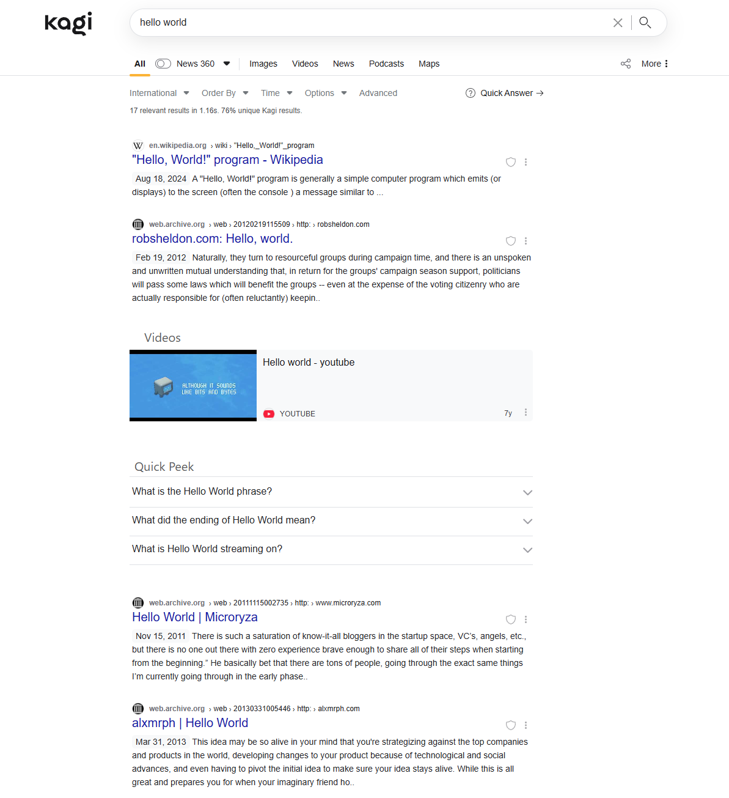
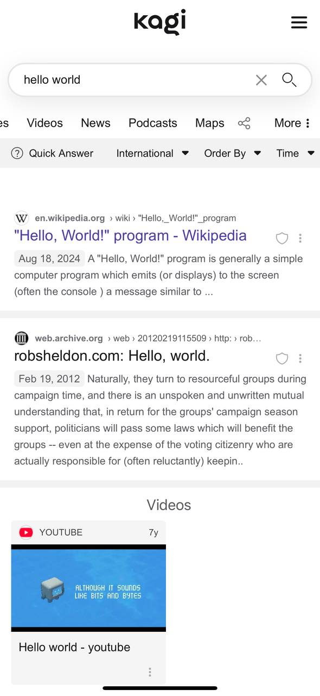
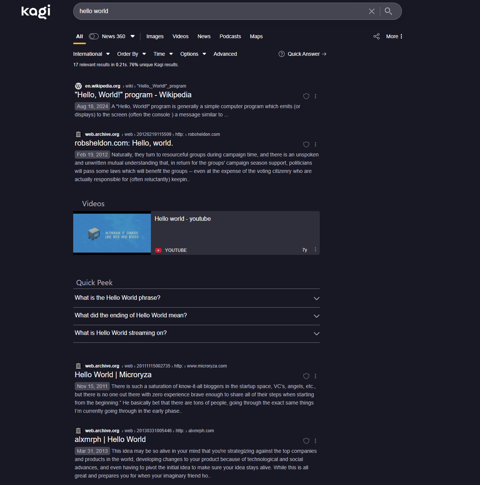
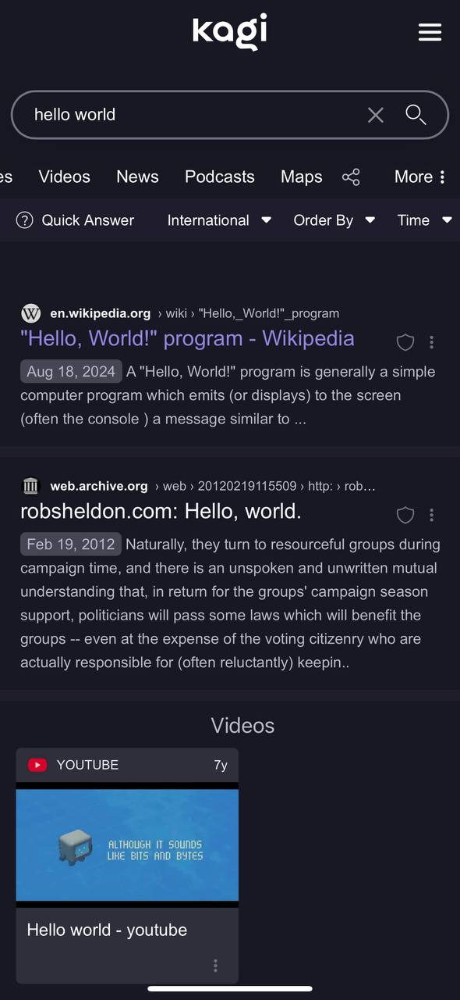

# Googlify Kagi Theme

This project provides a custom CSS theme for Kagi Search, inspired by Google's light color scheme.

## Compatibility

- **Light Mode**: Fully styled to replicate Google's light theme.
- **Dark Mode**: Retains Kagi's default dark mode styling without conflicts.

> **Important**: The light mode and dark mode styling are based on the `prefers-color-scheme` media query. This may not work as expected if the system or browser default color scheme differs from the Kagi settings.

### Recommended Kagi Settings

This CSS theme is designed to work with the following Kagi settings:

- **Theme**: Default
- **Font Size**: Normal
- **Default Light Theme**: Kagi Light (Default)
- **Default Dark Theme**: Old School Dark
- **Show Results**: Left
- **Show URL Favicons**: URL Adjacent
- **URL Display Style**: Split
- **URL Placement**: Above Title

For optimal results, ensure your system or browser color scheme aligns with the selected Kagi theme.

## Screenshots

### Light Mode
#### Desktop

#### Mobile

### Dark Mode
#### Desktop

#### Mobile

## Notes

- The CSS in this project is not commented. This is not an oversight but a deliberate choice due to Kagi's 20k character limit for custom CSS. Contributors should keep this limit in mind when making changes to ensure the theme remains functional.

